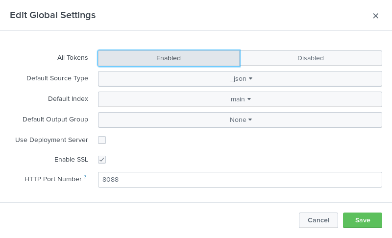

% Ellexus - Splunk Plug-in Configuration Guide

# Installing the Splunk Plug-in

Extract the Mistral plug-ins archive that has been provided to you in a
location accessible to all potential execution hosts. Please make sure
that you use the appropriate version of the plug-in for the architecture
of the machine on which the plug-in will run.

In addition, if the Mistral Plug-ins package was obtained separately
from the main Mistral product, please ensure that the version of the
plug-in downloaded is compatible with the version of Mistral in use.
Version 5.1.0 of the Splunk Plug-in as described in this document is
compatible with all versions of Mistral compatible with plug-in API
version 5. At the time of writing this is Mistral v2.11.2 and above.

The Splunk plug-in can be found in, for example:

    <installation directory>/output/mistral_splunk_v5.1.0/x86_64/

for the 64 bit Intel compatible version, and in:

    <installation directory>/output/mistral_splunk_v5.1.0/aarch32/

for the 32 bit ARM compatible version.

The plug-in must be available in the same location on all execution
hosts in your cluster regardless of architecture.

## Configuring an HTTP Event Collector End Point

Prior to using the Mistral Splunk plug-in HTTP Event Collector (HEC)
must be enabled and an appropriate end point must be configured within
Splunk.

The process for enabling HEC for the current version of Splunk (7.1.0 at
the time of writing) is as follows.

HEC can be enabled by opening Settings → Data inputs, selecting “HTTP
Event Collector” and then clicking the “Global Settings” button.

Configure HEC as appropriate for your environment however “All tokens”
must be set to “enabled”.



Once HEC has been enabled you must create a token for use with the
Mistral Splunk plug-in by clicking the green “New Token” button.

Again most of the configuration can be set as appropriate to your
environment. The Mistral Splunk plug-in does not use “indexer
acknowledgement” so we recommend that the option to enable this feature
is not set.

The plug-in writes data to HEC using JSON therefore we recommend that
“Source type” be set to “Select → Structured → \_json” however leaving
this set to the default value of “Automatic” should also work.

Once configured the token value generated can be used with the Mistral
Splunk Plug-in to push alert data into Splunk.

# Configuring Mistral to use the Splunk Plug-in

Please see the Plug-in Configuration section of the main Mistral User
Guide for full details of the plug-in configuration file specification.
Where these instructions conflict with information in the main Mistral
User Guide please verify that the plug-in version available is
compatible with the version of Mistral in use and, if so, the
information in the User Guide should be assumed to be correct.

## Mistral Plug-in Configuration

The Mistral plug-in configuration is in YAML and goes in the same file
as the main Mistral Configuration File. The plug-in is declared with the
`plugin` mapping and requires at minimum a `path` key-value pair. All of
the specified settings are members of the `plugin` mapping.

    plugin:
        path: plugins/mistral_splunk/x86_64/mistral_splunk

This section describes the specific settings required to enable the
Splunk Plug-in.

### Path

The `path` key must be set to the path of the splunk plguin-in
executable. This must be either absolute or relative to the
`MISTRAL_INSTALL_DIRECTORY` environment variable and needs to be accessible
and the same on all hosts. Environment variables in the value are not supported.

    path: plugins/mistral_splunk/x86_64/mistral_splunk

### Interval

The `interval` key takes a single integer value parameter. This
value represents the time in seconds the Mistral application will wait
between calls to the specified plug-in e.g.

    interval: 300

The value chosen is at the discretion of the user, however care should
be taken to balance the need for timely updates with the scalability of
the InfluxDB installation and the average length of jobs on the
cluster.

### Options

The `options` mapping is optional and lists all options to be passed to
the plug-in as command line arguments to the executable. A full
list of valid options for this plug-in can be found in section
[2.2](#anchor-9) [Plug-in Configuration File Options](#anchor-9). The order of
options is not preserved. These values are passed to the plug-in executable
as `--key=value`. For example,

    options:
        host: hostname
        error: filename

will pass to the plug-in executable the command line arguments 
`--host=hostname` and `--error=filename`.

### Switches

The `switches` mapping is optional and lists all switches to be passed to
the plug-in as command line arguments to the executable. A full
list of valid switches for this plug-in can be found in section
[2.3](#anchor-10) [Plug-in Configuration File Switches](#anchor-10). The order of
switches is not preserved. Switches not present are presumed to be off. These
switches are passed to the plug-in executable as `--key`. For example,

    switches:
        ssl: on

will pass to the plug-in executable the command line argument `--ssl`.

### Environment Variable Reporting
The `vars` mapping is optional and lists all environment variables that
the plug-in should store and report on. Environment variables not listed
are not reported on. These will be passed to the plug-in executable as
`--var=key`. For example,

    vars:
        USER: yes
        HOME: yes
        SHELL: no

will pass to the plug-in executable the command line arguments `--var=USER` and
`--var=HOME`.

## Plug-in Configuration File Options

The following command line options are supported by the Splunk plug-in.

    error: file

Specify location for error log. If not specified all errors will be
output on *stderr* and handled by Mistral error logging.

    host: hostname

The hostname of the Splunk server with which to establish a connection.
If not specified the plug-in will default to “*localhost*”.

    index: index_name

The name of the index in which to store data, if not specified this will
default to “*main*”.

    mode: octal-mode

Permissions used to create the error log file specified by the -e
option.

    port: number

Specifies the port to connect to on the Splunk server host. If not
specified the plug-in will default to “*8088*”.

    token: hash

The API endpoint token required to access the Splunk server. If hash is
specified as “*file:\<filename\>*” the plug-in will attempt to read the
token from the first line of *\<filename\>*.

## Plug-in Configuration File Switches

    ssl: on

Connect to the Splunk server via secure HTTP.

# Mistral’s Splunk Document Model

This section describes how the Mistral Splunk Plug-in stores data within
Splunk.

Documents are inserted into these indexes with the following labels and
structure:

```json
{
    "rule": {
        "scope",
        "type",
        "label",
        "measurement",
        "calltype",
        "path",
        "threshold",
        "timeframe",
        "size-min",
        "size-max"
        },
    "job": {
        "host",
        "job-group-id",
        "job-id"
        },
    "process": {
        "pid",
        "command",
        "file",
        "cpu-id",
        "mpi-world-rank"
        },
    "environment": {
        "var-name",
        …
        },
    "value"
}
```

The Mistral Splunk Plug-in will insert documents as described in the
following table.

| Field                    | Value                                                   |
| :----------------------- | :------------------------------------------------------ |
| `rule.scope`             | Inserted as a text string, set to either local or global indicating the scope of the contract containing the rule that generated the log. |
| `rule.type`              | Inserted as a text string, set to either `monitor` or `throttle` indicating the type of rule that generated the log. |
| `rule.label`             | Inserted as a text string, copied from the log message `LABEL` field unchanged. |
| `rule.measurement`       | Inserted as a text string, copied from the log message `MEASUREMENT` field unchanged. |
| `rule.calltype`          | Inserted as a text string, the list of call types specified in the log message `CALL-TYPE` field. The Mistral Splunk plug-in will always log compound types in alphabetical order. E.g. if the log message listed call types as `read+write+seek` the plug-in will normalise this to `read+seek+write`. |
| `rule.path`              | Inserted as a text string, copied from the log message `PATH` field unchanged. |
| `rule.threshold`         | Inserted as a number, the rule limit as reported in the log message `THRESHOLD` field converted into the smallest unit for the measurement type. For bandwidth rules this field will be bytes, for latency rules it is microseconds and for count rules the simple raw count. |
| `rule.timeframe`         | Inserted as a number, the timeframe the measurement was taken over as reported in the log message `THRESHOLD` field, converted into microseconds. |
| `rule.size-min`          | Inserted as a number, the lower bound of the operation size range as reported in the log message `SIZE-RANGE` field, converted into bytes. If this field was set to `all` in the log message this value will be set to 0. |
| `rule.size-max`          | Inserted as a number, the upper bound of the operation size range as reported in the log message `SIZE-RANGE` field, converted into bytes. If this field was set to `all` in the log message this value will be set to the maximum value of an `ssize_t`. This value is system dependent but for 64 bit machines this will typically be `9223372036854775807`. |
| `job.host`               | Inserted as a text string, copied from the log message `HOSTNAME` field with any domain component removed. |
| `job.job-group-id`       | Inserted as a text string, copied from the log message `JOB-GROUP-ID` field unchanged or `N/A` if this field is blank. |
| `job.job-id`             | Inserted as a text string, copied from the log message `JOB-ID` field unchanged or `N/A` if this field is blank. |
| `process.pid`            | Inserted as a number, copied from the log message `PID` field unchanged. |
| `process.command`        | Inserted as a text string, copied from the log message `COMMAND-LINE` field unchanged. |
| `process.file`           | Inserted as a text string, copied from the log message `FILE-NAME` field unchanged. |
| `process.cpu-id`         | Inserted as a number, copied from the log message `CPU` field unchanged. |
| `process.mpi-world-rank` | Inserted as a number, copied from the log message `MPI-WORLD-RANK` field unchanged. |
| `environment.var-name`   | Inserted as a text string. The string `var-name` will be replaced by an environment variable name as specified in a `--var` option. The value stored will be the value of this variable as detected when the plug-in is initialised. If no `--var` options are specified the environment block will be omitted. |
| `value`                  | Inserted as a number, copied from the log message `MEASURED-DATA` field converted into the smallest unit for the measurement type. For bandwidth rules this field will be bytes, for latency rules it is microseconds and for count rules the simple raw count. |
